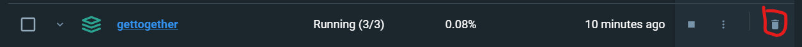

# GetTogether
Для того щоб запустити проєкт вам потрібно встановити docker (https://www.docker.com/products/docker-desktop/).
Після встановлення перевіряєте в консолі (Win+R -> cmd) командою **docker** та **docker-compose**. Обидві команди повинні вивести вам список команд.

Далі налаштовуєм сертифікати Ssl і прописуємо в консоль наступні команди:
**dotnet dev-certs https -ep $env:USERPROFILE\.aspnet\https\API.pfx -p ТУТ_ВАШ_ПАРОЛЬ_ЯКИЙ_ХОЧЕТЕ**
**dotnet dev-certs https -ep $env:USERPROFILE\.aspnet\https\WEB.pfx -p ТУТ_ВАШ_ПАРОЛЬ_ЯКИЙ_ХОЧЕТЕ**
**dotnet dev-certs https --trust**

В консолі переходим в папку з проєктом (cd Повний шлях до проєкту. На приклад "cd C:\Нова папка\Універ\Team Project\GetTogether").
Тут по черзі 
**cd API**
**dotnet user-secrets set "Kestrel:Certificates:Development:Password" "ТУТ_ВАШ_ПАРОЛЬ_ЯКИЙ_ХОЧЕТЕ_ЯКИЙ_ВИ_ВКАЗАЛИ_ВИЩЕ"**
**cd ../WEB**
**dotnet user-secrets set "Kestrel:Certificates:Development:Password" "ТУТ_ВАШ_ПАРОЛЬ_ЯКИЙ_ХОЧЕТЕ_ЯКИЙ_ВИ_ВКАЗАЛИ_ВИЩЕ"**

Головне щоб паролі співпадали з тими що вказали раніше. У файлі API.pfx і в папці API паролі повинні бути однаковими, WEB.pfx та папка WEB відповідно.

Далі вмикайте Docker Desktop(якщо це перший раз увійдіть в акаунт) переходите в консолі в папку з проєктом (**cd C:\Нова папка\Універ\Team Project\GetTogether** або **cd ..** якщо ви в папці WEB або API). І пишете наступну команду **docker compose up --build**.

Якщо ви все зробили правильно, то через хвилину всі контейнери зберуться і в Docker Desktop ви побачите:

Якщо ні, пишіть мені.

Далі переходите по посиланню **https://localhost:8002**. І починаєте тестувати, те що вам потрібно.

Якщо ви фронтенд розробник і ви окремо підіймаєте свій фронт то вам потрбно вказати ваше посилання в докер файлі(GetTogether/docker-compose.yml) або якщо ви працюєте з IDE то ось він:

Тут вас цікавить WEB_HOST

 

сюди ставите посилання з якого будете відправляти запити. І лише тоді підіймаєте контейнери **docker compose up --build**.

Кожен раз коли ви оновюєте проєкт вам потрібно очищати контейнери, робите це цією кнопочкою :

У вас при запуску може виникнути ось така проблема:

Якщо коротко, то коли докер підіймає контейнери то прив'язує до них конкретні порти і ми через них звертаємось до сайту **https://localhost:8002** -> тут порт це 8002. Може виникнути така ситуація, що порт уже буде зайнятий і контейнер не піднімется, і видасть помилку що була наведена вище. Вам потрібно просто закрити програми, що займають порти які нам потрібні. Дізнатись які саме програми можна в Resource Monitor -> Network -> Listening Ports.
